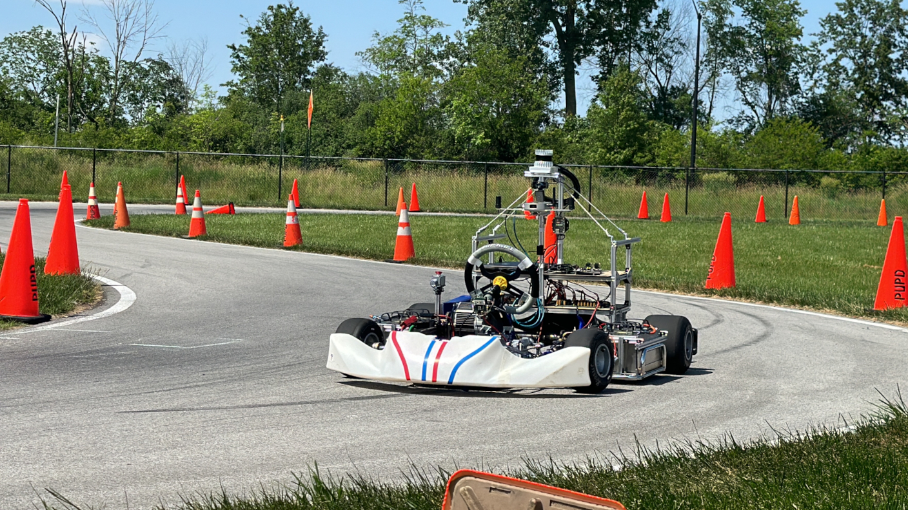

# AV4EV Gokart Project
## Overview  
This is the main repo for the Autoware AV4EV gokart project developed by Autoware's Center of Excellence (CoE) at University of Pennsylvania. AV4EV stands for open-source Autonomous Vehicle software for open-standard EV platforms. The goal of this project is to develop an accessible modular electric vehicle platform with perception and planning software solutions for autonomous racing research ODD. The gokart's 1/3 scale nicely bridges the gap between full-scale vehicles and RC cars for AV research. Our AV4EV gokart participated in and won the [Autonomous Karting Series (AKS)](https://www.autonomouskartingseries.com/) National Grand Prix 2023 and 2024 competitions at Purdue University.

<p align="center" width="100%">
    
</p>

## gokart-autoware repo

We ported the original [gokart-sensor](https://github.com/mlab-upenn/gokart-sensor/tree/ros2_humble_purepursuit) repo (ros2_humble_purepursuit branch) from last year into the Autoware framework (release/2024.06 version). The gokart packages are saved under the `gokart` folder under Autoware.Universe directory (gokart-autoware/src/universe/autoware.universe/). Perception and planning packages built for the reactive category race (no map) were also integrated. Follow the instructions to install the AV4EV gokart version of Autoware and Autoware.Universe.

To reduce the chance of dependency version conflicts, it is recommended that Autoware is installed on a new and clean Ubuntu 22.04 system. Avoid installing any other drivers/packages until this Autoware installation process is completed. The Autoware installation process will automatically install the best versions of NVIDIA driver, cuda driver, etc, for the Autoware packages.

## AV4EV Gokart links and Documentation

Main website: https://mlab-upenn.github.io/av4ev_web/

Hardware documentation: https://go-kart-upenn.readthedocs.io/ (pending update after AKS competition)

Embedded system software: https://github.com/mlab-upenn/gokart-mechatronics (pending update after AKS competition)

AV4EV gokart simulator: https://github.com/mlab-upenn/AV4EV_Sim

Reactive-category simulation: https://youtu.be/gzHu0ZZdxbY

Pennovation environment preview: https://www.youtube.com/watch?v=lOTM_DDfbcE

AKS 2024 race vidoes:  
    Open-category (map allowed): https://www.youtube.com/watch?v=pdBTIgp2APQ  
    Reavtive-category (map not allowed): https://www.youtube.com/watch?v=RrzQWShv_7Y  


# Installation Instruction for AV4EV Gokart-Autoware

## Prerequisites
Ubuntu 22.04  
Git

## 1. Install ROS2 Humble
Follow the [instruction](https://docs.ros.org/en/humble/Installation/Ubuntu-Install-Debians.html) to install ROS2 Humble

## 2. Install original gokart-sensor repo dependencies

```
# general
pip install transforms3d trajectory_planning_helpers

# for OAK-D camera:
sudo apt install ros-humble-depthai-ros

# for IMU driver:
pip install pyserial
```

## 3. Install AV4EV gokart Autoware and Autoware.Universe
This is the modified instruction of [Autoware installation from source](https://autowarefoundation.github.io/autoware-documentation/main/installation/autoware/source-installation/)

### 1. Set up Autoware development environment
Clone the gokart-autoware repo and move to the directory.

```
git clone https://github.com/mlab-upenn/gokart-autoware
cd gokart-autoware
```

### 2. Install environment dependencies using the provided Ansible script.
Enter `Y` when asked to install NVIDIA or Cuda drivers

```
./setup-dev-env.sh
```

### 3. Set up a workspace
Create the src directory and clone repositories into it. The autoware.repos file was modified to import the AV4EV gokart version of Autoware.Universe. Autoware uses vcstool to construct workspaces.

```
cd gokart-autoware
mkdir src
vcs import src < autoware.repos
```

Install dependent ROS packages.
Autoware requires some ROS 2 packages in addition to the core components. The tool rosdep allows an automatic search and installation of such dependencies.

```
source /opt/ros/humble/setup.bash
rosdep update
rosdep install -y --from-paths src --ignore-src --rosdistro $ROS_DISTRO -r
```

Build the workspace.
Autoware uses colcon to build workspaces. For more advanced options, refer to the documentation.

```
colcon build --symlink-install --cmake-args -DCMAKE_BUILD_TYPE=Release
```

## 4. Set up Udev rules and Ethernet

BNO055 IMU
```bash
create the udev rule file
sudo gedit /etc/udev/rules.d/bno055.rules

# Copy & paste the following rules, save and exit.
ACTION=="add", ATTRS{idVendor}=="0403", ATTRS{idProduct}=="6015", MODE="0666", SYMLINK+="sensors/bno055"
```

Nucleo Main Board
```bash
create the udev rule file
sudo gedit /etc/udev/rules.d/usb_uart.rules

# Copy & paste the following rules, save and exit.
ACTION=="add", ATTRS{idVendor}=="0403", ATTRS{idProduct}=="6001", MODE="0666", SYMLINK+="sensors/usb_uart"
```

Reload and trigger the rules
```bash
sudo udevadm control --reload-rules
sudo udevadm trigger --action=change
```

Unplug and replug in the devices. and you should find the devices by running
```bash
ls /dev/sensors
```

Ethernet

The Ouster is connected to the laptop through ethernet cable. After connecting, choose manual configuration and under IPv4, set Address to 192.0.2.200 and Netmask to 255.255.255.0. Restart your system and ping 192.0.2.100 to verify succesful connection.

# Usage

### Sensor Drivers

Run ros2 launch/run in different terminals for each driver(see [tmux](#tmux-intro))

```bash
# under the gokart-autoware folder, source
cd gokart-autoware
source /opt/ros/humble/setup.bash && source install/setup.bash

# launch Ouster driver
ros2 launch ouster_ros sensor.launch.xml sensor_hostname:=192.0.2.100 timestamp_mode:=TIME_FROM_ROS_TIME

# launch gnss driver(default config is set to gnss.yaml)
ros2 launch septentrio_gnss_driver rover.py

# launch imu driver(default mode is set to NDOF)
ros2 launch ros_imu_bno055 imu_launch.py

# launch OAK-D camera driver
ros2 launch depthai_examples rgb_publisher.launch.py
```

### LiDAR SLAM

```
ros2 launch lidarslam lidarslam.launch.py
```


### Checking
You can show all the topic list and echo some specific topics to see if the drivers and applications are launched successfully.
```
ros2 topic list
ros2 topic echo <topic name> --no-arr
```

## Run Open-Category
Under development

## Run Reactive-Category
Under development


# Reference Links

## Sensor Drivers and Manual

(1) Senpentrio Mosaic-H Dev Kit ([Manual](https://www.septentrio.com/en/products/gps/gnss-receiver-modules/mosaichdevkit)) + Swift Navigation RTK ([Link](https://www.swiftnav.com/skylark))

(2) Ouster OS1 LiDAR ([Manual](https://data.ouster.io/downloads/software-user-manual/software-user-manual-v2p0.pdf) + [GitHub](https://github.com/ouster-lidar/ouster-ros/tree/ros2))

(3) OAK-D camera ([Manual](https://docs.luxonis.com/projects/hardware/en/latest/pages/BW1098OAK.html) + [GitHub](https://github.com/luxonis/depthai-ros))

(4) BNO055 IMU ([Manual](https://cdn-shop.adafruit.com/datasheets/BST_BNO055_DS000_12.pdf)) + LC231X UART to Serial Module ([Manual](https://www.digikey.com/en/products/detail/ftdi-future-technology-devices-international-ltd/LC231X/6823712))

## Tmux intro

A cheatsheet for the original tmux shortcut keys can be found [here](https://tmuxcheatsheet.com/). To know about how to change the configuration of tmux to make it more  useable (for example, if you want to toggle the mouse mode on when you  start a tmux bash session or change the shortcut keys), you can find a  tutorial [here](https://www.hamvocke.com/blog/a-guide-to-customizing-your-tmux-conf/).

